<div align="center">

# ⚡ FlowZint

### AI lead capture & conversion — qualify, score, book, and sync, on autopilot.

FlowZint drops an AI concierge on your marketing site that **qualifies every visitor in real time**, **scores them with a deterministic rubric**, **books demos**, fires **mock Slack alerts** for hot leads, and syncs everything into a **built-in CRM** with **funnel analytics**.

Next.js 14 · TypeScript · Tailwind · Framer Motion · SQLite · Anthropic Claude

</div>

---

## ✨ Highlights

- **Conversational qualification** — an AI concierge ("Zia") asks one natural question at a time and maintains **structured state turn-by-turn** (never re-parsing the whole transcript).
- **Deterministic scoring** — a pure function grades company size, budget, timeline and use-case fit on a transparent **0–11 rubric**. The LLM never guesses the score.
- **Smart routing** — Hot → instant booking + Slack alert; Warm → booking offer; Cold → nurture resource + newsletter capture.
- **Objection handling** — "too expensive", "not ready", "need approval" and "just exploring" are detected mid-conversation and answered with canned rebuttals.
- **Anti-troll moderation** — profanity/gibberish answers are rejected and re-prompted (rule-based, no key needed); repeat offenders are flagged and never alert sales.
- **Answers questions** — a built-in mini-FAQ lets Zia explain what FlowZint does, how it works, and pricing, mid-conversation, plus tappable quick-reply chips.
- **Transparent CRM** — click any lead to see *why* it scored the way it did, every captured answer, and the full transcript.
- **Optional real integrations** — drop in env vars for real emails (Resend), Slack alerts, or an n8n webhook; all no-op cleanly when unset.
- **Light & dark themes** — toggle in the nav / dashboard, dark by default, preference persisted.
- **Embedded booking** — 5 generated slots across the next 3 business days, with a polished confirmation animation.
- **Live CRM & analytics** — contacts, leads, opportunities and meetings, plus a conversion funnel with drop-off %, KPI cards and a 14-day activity chart.
- **Works with or without an API key** — a keyless heuristic engine keeps the full demo playable offline; drop in an Anthropic key for genuinely fluent conversation.

## 🧱 Tech stack

| Layer        | Choice                                              |
| ------------ | --------------------------------------------------- |
| Framework    | Next.js 14 (App Router) + TypeScript                |
| Styling      | Tailwind CSS + shadcn/ui + custom dark glass theme  |
| Animation    | Framer Motion                                       |
| Fonts        | Space Grotesk (display) + Inter (body) via next/font|
| Database     | SQLite via better-sqlite3 (seeded on first run)     |
| AI           | Anthropic Claude (`@anthropic-ai/sdk`), server-side |
| Charts       | Recharts + hand-rolled SVG sparklines/funnel        |
| Icons        | lucide-react                                        |

---

## 🚀 Quick start

```bash
# 1. Install
npm install

# 2. (optional) add your Anthropic key for live AI conversation
cp .env.example .env
#   → set ANTHROPIC_API_KEY=sk-ant-...
#   without a key, FlowZint uses its built-in heuristic engine

# 3. Run — the database auto-seeds on first boot
npm run dev
```

Open **http://localhost:3000**.

| Route         | What it is                                             |
| ------------- | ------------------------------------------------------ |
| `/`           | Marketing home (hero, features, testimonials)          |
| `/pricing`    | Pricing tiers + FAQ (chat auto-opens after 8s)         |
| `/book-demo`  | Standalone booking calendar (chat auto-opens after 8s) |
| `/crm`        | Internal CRM dashboard                                  |
| `/analytics`  | Conversion funnel + KPIs                                |

> The chat widget lives in the bottom-right corner of every marketing page. Lead scores are **only** ever visible on `/crm` and `/analytics` — never to the visitor.

### Scripts

| Command            | Description                                    |
| ------------------ | ---------------------------------------------- |
| `npm run dev`      | Start the dev server (auto-seeds if empty)     |
| `npm run build`    | Production build                               |
| `npm run start`    | Run the production build                       |
| `npm run seed`     | Wipe & re-seed the database with demo data     |
| `npm run db:reset` | Alias to reset + re-seed                        |
| `npm run lint`     | Lint                                           |

---

## 🏗️ Architecture

```mermaid
flowchart TD
    V[Website visitor] -->|chats| W[Chat Widget<br/>Framer Motion]
    W -->|POST /api/chat| O[Turn Orchestrator]

    O --> Q{Qualification engine}
    Q -->|ANTHROPIC_API_KEY set| C[Claude tool-use<br/>structured extraction]
    Q -->|no key| H[Heuristic fallback]
    C --> S[QualificationState<br/>maintained turn-by-turn]
    H --> S

    S --> SC[scoreLead&#40;&#41;<br/>pure 0–11 rubric]
    SC --> R{Route by temperature}
    R -->|Hot 8–11| HOT[Booking + mock Slack alert + Opportunity]
    R -->|Warm 5–7| WARM[Booking offer]
    R -->|Cold 0–4| COLD[Nurture resource + newsletter]

    O --> DB[(SQLite)]
    HOT --> DB
    WARM --> DB
    COLD --> DB

    DB --> CRM[/crm dashboard/]
    DB --> AN[/analytics funnel/]
    HOT --> BELL[Notification bell<br/>polled every 5s]
```



### How state is maintained (not re-parsed)

Each turn, the orchestrator loads the session's `QualificationState`, sends the transcript to the qualification engine, and merges **only the newly extracted fields** back into that state (`mergeState`). Scoring runs on the accumulated state via a pure function — so the score is deterministic and auditable, and the LLM is never asked "what's the score?".

### Data model

```
contacts ──1:N── leads ──1:1── opportunities
   │               │
   │               └──1:N── meetings
   │
chat_sessions ──1:N── chat_messages
events            (funnel milestones, deduped per session)
slack_notifications
```

---

## 🎯 Scoring rubric

Scoring is a **pure function** (`src/lib/scoring.ts`) — fully deterministic, testable, and never LLM-guessed. It's **intent-first**: budget, timeline and use-case fit dominate, and company size is only a small modifier — so a small-but-serious, well-funded, urgent buyer is never mislabelled as cold.

| Dimension        | Signal                          | Points |
| ---------------- | ------------------------------- | :----: |
| **Budget**       | at/above anchor tier ($499/mo)  |   4    |
|                  | vague / unsure                  |   2    |
|                  | below tier                      |   0    |
| **Timeline**     | < 1 month                       |   4    |
|                  | 1–3 months                      |   2    |
|                  | 3 months+ / exploring           |   1    |
| **Use-case fit** | clear match                     |   3    |
|                  | vague                           |   1    |
| **Company size** | 500+                            |   2    |
| _(modifier)_     | 51–500                          |   1    |
|                  | 1–50                            |   0    |

**Total 0–13 →** `0–4` **Cold** 🔵 · `5–8` **Warm** 🟠 · `9–13` **Hot** 🔴

The full breakdown (how each dimension contributed) is visible per-lead in the CRM — click any lead row to open its detail drawer with the score rationale, captured answers, and full chat transcript.

| Temperature | Routing                                                        |
| ----------- | -------------------------------------------------------------- |
| 🔴 Hot      | Immediate booking offer **+ mock Slack notification** + Opportunity |
| 🟠 Warm     | Booking offer (no notification)                                |
| 🔵 Cold     | Nurture resource + newsletter capture                          |

---

## 🗂️ Project structure

```
src/
├── app/
│   ├── (marketing)/        # home, pricing, book-demo (+ chat widget)
│   ├── (dashboard)/        # crm, analytics (+ sidebar/topbar)
│   ├── api/                # chat, booking, notifications, mock-slack, newsletter
│   └── layout.tsx          # fonts + root shell
├── components/
│   ├── ui/                 # shadcn/ui primitives
│   ├── chat/               # ChatWidget + mount
│   ├── marketing/          # navbar, footer, hero, sections
│   ├── dashboard/          # sidebar, KPI cards, CRM view, analytics view, bell
│   └── shared/             # lead-score badge
├── lib/
│   ├── db.ts               # SQLite connection + schema
│   ├── repo.ts             # all data access + analytics queries
│   ├── scoring.ts          # pure scoring rubric
│   ├── conversation.ts     # state, rebuttals, routing copy
│   ├── anthropic.ts        # Claude tool-use + keyless fallback
│   ├── orchestrator.ts     # qualify → score → route → persist
│   ├── booking.ts          # slot generation
│   └── seed.ts             # deterministic demo-data generator
├── instrumentation.ts      # auto-seed on server boot
└── scripts/                # seed.ts, reset.ts
```

## 🔌 API reference

| Endpoint             | Method | Purpose                                          |
| -------------------- | ------ | ------------------------------------------------ |
| `/api/chat`          | POST   | Start a session / process a qualification turn   |
| `/api/booking`       | GET    | Fetch available slots                            |
| `/api/booking`       | POST   | Book a meeting (creates Meeting + Opportunity)   |
| `/api/notifications` | GET    | List Slack alerts + unread count (bell polls this)|
| `/api/notifications` | POST   | Mark alerts read                                 |
| `/api/mock-slack`    | POST   | Log a formatted "Slack" alert                    |
| `/api/newsletter`    | POST   | Capture a cold-lead email                        |

The Anthropic key is read **server-side only** — it never reaches the browser bundle.

---

## 📸 Screenshots

> Drop real captures into `/docs` at these paths to render them here.

| Chat qualification | CRM dashboard |
| ------------------ | ------------- |
|  |  |

| Analytics funnel | Landing page |
| ---------------- | ------------ |
|  |  |

---

## 🚫 Non-goals

By design, FlowZint does **not** implement real Slack/Teams/Calendly OAuth, an A/B-testing framework, a no-code flow builder, multi-tenant auth, or real SMS/email sending. Slack alerts and the calendar are realistic mocks for the demo.

## 📄 License

MIT — a fictional product built for a hackathon demo.
